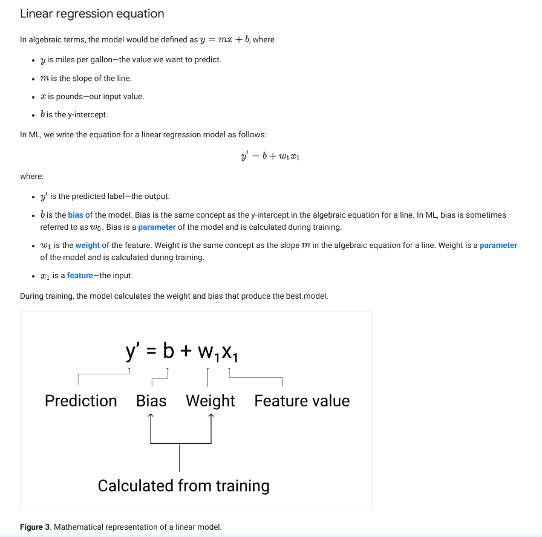

learning objectives:
    -explain a loss function and how it works
    -define/describe how gradient descent finds the optimal model parameters
    -describe how to tune hyperparameters to efficiently train a liniar model

    Liniar regression (mllr)
        *is a statistical technique used to find the relationship between variables. In a ml context, mllr finds the relationship between features and a label

        equation: 

        y' = bias + weight1*feature1 + weight2*feature2 + weight3*feature3 + weight4*feature4

    Loss
        *is a numerical metric that describes how wrong a model's predictions are
        loss measures the distance between the model's predictions and the actual labels
        the goal of training a model is to minimize the loss, reducing it to its lowest possible value

        Distance of a loss:
            loss focuses on the distance between the values, not the direction, therefore we remove the design of the distance;
                most common way of doing so:
                    -absolute value of the diffrence between the actual value and the prediction
                    -square the difference between the actual value and the prediction
        
        Types of loss:
            -L1 loss: Sum of the absolute values of the diffrence between the predicted values and actual values
            -Mean absolute error (mae): The average of L1 losses across a set of examples
            -L2 loss: The sum of the squared difference between the predicted values and the actual values
            -Mean square error (mqe): the average of L2 loosses across a set of examples

        When choosing the best loss function, consider how you want the model to treat outliers. For instance, MSE moves the model more toward the outliers, while MAE doesn't. L2 loss incurs a much higher penalty for an outlier than L1 loss.

    Gradient descent
        *is a mathematical formula that iteratively finds the weight and bias that produce the model with the lowest loss. Gradient descent finds the best weight and bias by repeating the following process for a number of user-defined iterations

        *the model begins training with randomized weights and biases near zero, and then repeats the following
            -calculate the loss with current w and b
            -determine the direction to move the w and b to reduce loss
            -move the w and b values a small amount in the direction that reduces loss
            -return to step one and repeat the process until the model can't reduce the loss any further

        a model trains untill it converges

    Model convergence and loss curves
        *when training a model, you'll often look at a loss curve to determine if the model has converged. The loss curve shows how the loss changes as the model trains

    Convergence and convex functions
        *the loss function for linear models always produce a convex surface
            cool surface i cannot produce in a text editor that describes how bias weight and loss

    Hyperparameters:
        variables that control different aspects of training
            -learning rate
                *float that influences how quickly the model converges; if the lr is too low the model can take a long time to converge, however, if the learning rate is too high, the model never converge, but instead bounces around the weights and bias that minimize the loss
                the ideal lr helps the model to converge within a resonable no of iteration
            -batch size
                *refers to the number of examples the model processes before updating its weights and bias; using the full batch is not practical
                *2 common techniques to get the right gradient on average without needing to look at every eample in the dataset are stochastic gradient descent [SGD] / [mini-batch SGD] mini-batch stochastic gradient descent
            -epochs
                *an epoch = the model has processed every example in the training set once